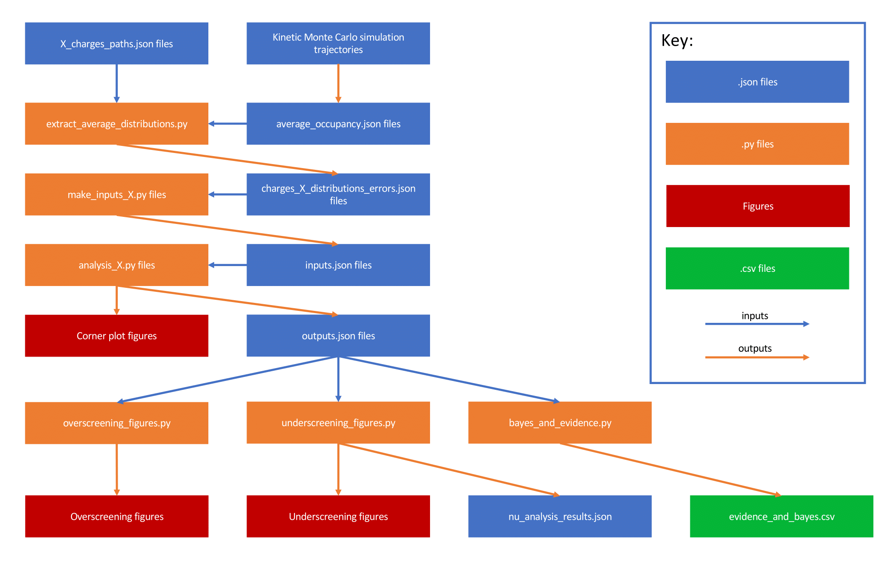

# Data  for &ldquo;Overscreening and Underscreening in Solid-Electrolyte Grain Boundary Space-Charge Layers&rdquo;
Authors:
- Jacob M. Dean ORCID [0000-0003-3363-4256](https://orcid.org/0000-0003-3363-4256)
## Summary
This repository contains all the time-averaged distributions of every kinetic Monte Carlo simulation conducted for the paper, and all the analysis required to make the figures for the paper. In addition, corner plots for each parameter set and all values of evidence and Bayes factors are provided.
To run the complete data analysis, run the following commands from the kmc_paper_data directory:
```
pip install -r requirements.txt
snakemake clear
snakemake --cores all
```
Note however, that depending on the number of cores devoted to calculating the analysis, this could take anywhere between several hours and a day.
## Contents:
- `README.md`: This file.
- `kmc_paper_data/requirements.txt`: Python dependencies.
- `kmc_paper_data/Snakefile`: The top-level `snakemake` analysis workflow script.
- `kmc_paper_data/Figures`: Manuscript figures generated by running the analysis workflow.
- `kmc_paper_data/simulation_data/`: All the average occupancies from each simulation.
- `kmc_paper_data/averaged_distribution`: The averaged distributions and associated errors for each parameter set.
- `kmc_paper_data/charges_105`: The results for a system with 105 charges.
- `kmc_paper_data/charges_210`: The results for a system with 210 charges.
- `kmc_paper_data/charges_421`: The results for a system with 421 charges.
- `kmc_paper_data/charges_2109`: The results for a system with 2109 charges.
- `kmc_paper_data/make_inputs`: Files required to make input files for uravu analysis.
- `kmc_paper_data/paths`: The relative paths required to make the average distributions for each parameter set.
- `kmc_paper_data/uravu_analysis_scripts`: The analysis scripts for the Bayesian analysis.
- `kmc_paper_data/bayes_and_evidence.py`: Script that extracts Bayes factors and evidence values.
- `kmc_paper_data/evidence_and_bayes.csv`: Tabulated evidence and Bayes factor values.
- `kmc_paper_data/extract_average_distributions.py`: Script that extracts averaged distributions from simulated results.
- `kmc_paper_data/nu_analysis_results.json`: the results of the uravu nu analysis.
- `kmc_paper_data/overscreening_figure.py`: Script to produce the overscreening figures.
- `kmc_paper_data/underscreening_figures.py`: Script to produce the underscreening figures.
## Data processing workflow
Data processing is mostly managed using [`snakemake`](https://snakemake.readthedocs.io), and uses the scripts in the `kmc_paper_data` directory. The full data analysis workflow can be rerun with:
```
snakemake --cores all clear
snakemake --cores all
```

## Overview of the full data workflow



The data work flow can be described be seen in the image above and is described below. 

- Simulation trajectories from kinetic Monte Carlo simulations produce a set of `average_occupancy.json` files. The simulation trajectories for the kinetic Monte Carlo simulations are not provided here because it is impractical to store such large files here. These `average_occupancy.json` files store the time-averaged distribution of charges across a single simulation, and are stored in the `kmc_paper_data/simulation_data` directory. 
- From these `average_occupacy.json` files we calculate the average half space-charge distribution (assuming a symmetric distribution around the grain boundary). These average half space-charge distributions, along with associated errors for each distance from the grain boundary, are stored in the `kmc_paper_data/averaged_distributions` directory.
- These averaged distributions are used to create `kmc_paper_data/charges_X/permittivity_Y/inputs.json` files, , where X = (number of charges) and Y = (relative permittivity), that are used to conduct the Bayesian analysis. 
.-  The averaged half space-charge distributions and associated standard error values are used as inputs into uravu to conduct Bayesian analysis. The Bayesian analysis returns distributions for each parameter of both models (the oscillatory and purely exponential model). These outputs are stored in `kmc_paper_data/charges_X/permittivity_Y/outputs.json` directories Corner plots of these distributions are stored in the same location.
-  Fig. 2 and Fig. S1 are produced by the `kmc_paper_data/overscreening_figures.py` file. 
-   Fig. 3, Fig. S2 and `nu_analysis_results.json` are produced by running `kmc_paper_data/underscreening_figures.py`. The maximum likelihood parameter and 95% confidence interval, stored in the `kmc_paper_data/charges_X/permittivity_Y/outputs.json` files, are used to plot Fig. 3 and Fig. S2. The full distributions of the appropriate alpha parameter are used to calculate the value of nu.
-   The `kmc_paper_data/evidence_and_bayes.csv` file that tabulates all evidence and Bayes factor values is produced by the `kmc_paper_data/bayes_and_evidence.py` file. 
